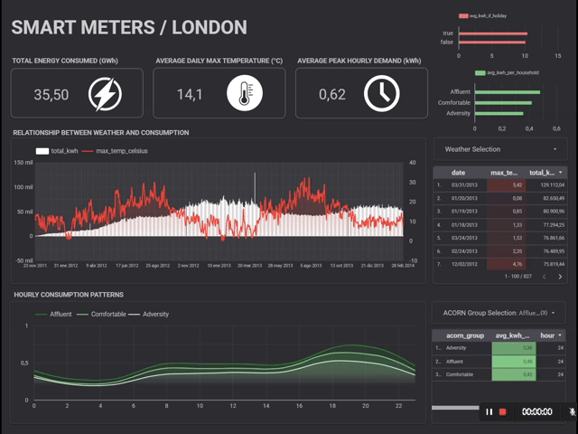

# Smart Meters in London: End-to-End Data Engineering Pipeline

Capstone project for the [Data Engineering Zoomcamp 2026](https://datatalks.club) by DataTalks.Club.

---

<p align="center">
  
</p>

> Interactive Looker Studio dashboard built on optimized BigQuery marts. See [Section 5](#5-dashboard--insights) for a full breakdown of each analytical tile.

---

## Table of Contents

1. [Project Overview](#1-project-overview)
2. [Architecture & Tech Stack](#2-architecture--tech-stack)
3. [The Dataset](#3-the-dataset)
4. [Data Modeling & Transformations](#4-data-modeling--transformations-dbt)
5. [Dashboard & Insights](#5-dashboard--insights)
6. [CI/CD Pipeline](#6-cicd-pipeline)
7. [Reproducibility](#7-reproducibility)
8. [Acknowledgements](#8-acknowledgements)

---

## 1. Project Overview

### The Problem

The transition to smart energy grids generates massive volumes of high-frequency data. This project tackles the **Smart Meters in London** dataset: half-hourly energy consumption readings for over 5,500 households, totaling nearly 170 million individual records.

The challenge was not just handling that volume, but enriching the data to extract meaningful insight. The analysis focuses on two external dimensions that drive consumption behavior:

- **Weather conditions:** crossing historical consumption data with daily temperature metrics to surface seasonal patterns.
- **Socio-economic profiles:** segmenting households using the ACORN classification to understand how different demographic groups consume energy throughout the day — identifying peak hours and baseline usage.

### The Goal

The primary objective is to build a robust, scalable, and fully automated **ELT (Extract, Load, Transform)** pipeline applying modern data engineering practices.

Key architectural achievements:

- **Infrastructure as Code:** all Google Cloud resources (GCS, BigQuery) managed entirely via Terraform.
- **Modern data stack:** Kestra for workflow orchestration, dlt for reliable data ingestion, dbt for modeling and testing.
- **Data warehouse optimization:** partitioning and clustering in BigQuery to keep dashboard queries performant and cost-effective.
- **CI/CD integration:** automated formatting checks and SQL syntax validation via GitHub Actions on every push.

---

## 2. Architecture & Tech Stack

### Pipeline Architecture

> ``

The pipeline follows a modern ELT approach, orchestrated end-to-end:

1. **Extraction & Loading (hybrid approach):** data is pulled from Kaggle via API, orchestrated by Kestra. A hybrid loading strategy handles the two data tiers differently:
   - *Dimensional data:* small metadata tables (weather records and household profiles) are ingested and loaded directly into BigQuery using **dlt**.
   - *Fact data (massive volume):* the heavy `hhblock` dataset is uploaded directly to Google Cloud Storage and mounted in BigQuery as an **External Table**, bypassing ingestion bottlenecks entirely.

2. **Transformation:** once in the warehouse, **dbt** cleans, unpivots, tests, and models the data into production-ready marts.

3. **Visualization:** Looker Studio connects directly to the optimized BigQuery marts.

### Technologies Used

| Layer | Tool |
|---|---|
| Cloud Platform | Google Cloud Platform (GCP) |
| Data Lake | Google Cloud Storage (GCS) |
| Data Warehouse | BigQuery |
| Infrastructure as Code | Terraform |
| Workflow Orchestration | Kestra |
| Data Ingestion | dlt (data load tool) |
| Data Transformation & Testing | dbt Core |
| Business Intelligence | Looker Studio |

---

## 3. The Dataset

The source data is the **Smart Meters in London** dataset, available on Kaggle. It tracks energy consumption for 5,567 London households that participated in the UK Power Networks Low Carbon London project between November 2011 and February 2014.

The project uses three main tables:

1. **`hhblock_dataset`** — half-hourly energy readings (the core fact table).
2. **`informations_households`** — ACORN socio-economic classification for each meter.
3. **`weather_daily_darksky`** — daily maximum and minimum temperatures in Celsius.

### Design Decision: Optimizing Ingestion

The Kaggle dataset offers consumption data in two formats: a long format (~167 million rows) and a wide block format (`hhblock`, ~3.5 million rows where each row contains 48 half-hour columns for a single day).

**The choice:** ingest the `hhblock` dataset rather than the 167M-row file.

**Why:** this significantly reduced network bandwidth and ingestion time from source to data lake.

**The trade-off:** data arrived in BigQuery in an unnormalized, wide state. The heavy computational work — unpivoting 48 columns into rows — was deliberately pushed downstream to the transformation layer, where **dbt** and BigQuery's massively parallel processing handle it in seconds rather than letting it bottleneck the ingestion pipeline.

---

## 4. Data Modeling & Transformations (dbt)

With raw data sitting in BigQuery, **dbt** takes over to clean, model, and test it into production-ready marts. The project is structured in two layers.

### Staging Layer (Views)

Materialized as `views`. These provide a clean, standardized interface over the raw sources: column renaming, type casting, and initial date and temperature parsing.

### Production / Marts Layer (Tables)

This is where the computational heavy lifting happens. Models are materialized as `tables` with aggressive optimization:

- **The `UNPIVOT` transformation:** the raw `hhblock` external table holds 48 columns, one per half-hour of the day. A SQL transformation unpivots these into a normalized long-format time-series structure.
- **Data quality tests:** enforced via `schema.yml`. Tests include `not_null` constraints, referential integrity checks, and strict `accepted_values` validation (e.g., hours of the day confined to 0–23).
- **Partitioning and clustering:** the final daily mart (`mart_daily_energy_weather`) is:
  - Partitioned by `consumption_date` (daily granularity).
  - Clustered by `acorn_group` and `household_id`.

---

## 5. Dashboard & Insights

The presentation layer is an interactive dashboard built on **Looker Studio**, connected directly to the partitioned BigQuery marts (`mart_daily_energy_weather` and `mart_hourly_profile`). The dashboard uses a dark theme designed for analytical clarity.

<p align="center">
  
</p>

### Key Analytical Tiles

**A. Hourly Consumption Patterns (The "Duck Curve")**

An interactive line chart breaking down normalized average consumption across the 24 hours of the day, segmented by socio-economic group.

- The data shows a sharp demand peak around 18:00 across all demographics, representing the return-home effect.
- The Affluent group (highest consumption curve) vs. Comfortable vs. Adversity (lowest baseline) segmentation is clearly visible — critical information for utility companies designing targeted demand-reduction programs.

**B. Average Consumption Breakdown by Demographics**

A donut chart showing percentage distribution of total energy use by ACORN group. For example: Affluent at 11.52% vs. Adversity at 8.54% of average consumption per household. Complements the temporal view with a categorical market-share perspective.

**C. Holiday vs. Weekday Consumption**

A stacked bar chart comparing business days against holidays and weekends. Reveals how different household types shift their consumption on non-working days — whether the evening peak moves, and whether overall usage increases. Operationally relevant for grid stabilization planning.

**D. Weather Impact Analysis**

A multi-year time-series chart (Nov 2011 – Feb 2014) overlaying daily maximum temperatures (`max_temp_celsius`) against total energy demand (`total_kwh`).

- The inverse correlation is visually clear: consumption peaks during cold winter months (Dec–Jan) and drops sharply in summer (Jun–Aug).
- A ranked table to the right lists the highest-usage months, tied directly to temperature extremes — a standard input model for energy price forecasting.

---

## 6. CI/CD Pipeline

To maintain code quality and prevent broken code from reaching `main`, a Continuous Integration pipeline is implemented using **GitHub Actions**.

On every `push` or `pull_request` to `main`, the workflow automatically runs two jobs:

1. **Terraform Inspector:** runs `terraform fmt -check` and `terraform validate` to ensure Infrastructure as Code is correctly formatted and syntactically valid.
2. **dbt Compiler:** creates a dummy `profiles.yml` and runs `dbt parse` to catch SQL syntax errors or missing dependencies in the transformation layer before any deployment.

> Continuous Deployment of the data itself is handled by **Kestra**, which keeps Google Cloud credentials completely isolated from the public repository.

---

## 7. Reproducibility

The project is built with reproducibility in mind. A `Makefile` wraps the main operations so the entire infrastructure and orchestration layer can be brought up with a handful of commands.

### Prerequisites

Before starting, have the following ready:

- **Google Cloud Platform:** a project with a Service Account holding `Owner` or `Editor` privileges, and its downloaded JSON key.
- **Kaggle API:** an account on Kaggle and the `kaggle.json` API key.
- **Local tools:** `Docker`, `Docker Compose`, `Terraform`, and `Make`.

### Step-by-Step Setup

**Step 1 — Clone the repository**

```bash
git clone https://github.com/axl-builder/london-smartmeter-energy-pipeline.git
cd london-smartmeter-energy-pipeline
```

**Step 2 — Configure credentials and variables**

- Place the GCP Service Account key inside the `terraform/` folder (or update the path in `variables.tf`).
- Place `kaggle.json` where Kestra can access it, as defined in your Kestra flow.
- Update `project_id` and `bucket_name` in `terraform/variables.tf` to match your GCP project.

**Step 3 — Provision the cloud infrastructure**

```bash
make tf-init
make tf-apply
```

Type `yes` when prompted by Terraform. This provisions the GCS bucket and BigQuery datasets.

**Step 4 — Start the orchestrator**

```bash
make up
```

Once running, open `http://localhost:8080` in your browser to access the Kestra UI.

**Step 5 — Execute the pipeline**

- Import the `.yaml` flow files from the `kestra/` directory into the Kestra UI.
- Click **Execute** on the main pipeline flow.

Kestra will download the data via dlt, upload it to GCS, mount it in BigQuery, and trigger the dbt transformations automatically.

**Step 6 — Tear down**

To avoid unnecessary cloud costs once you are done:

```bash
make tf-destroy
make down
```

This destroys the cloud infrastructure and stops the local Docker containers.

---

## 8. Acknowledgements

This project was developed as the Capstone Project for the **Data Engineering Zoomcamp (2026)** by DataTalks.Club. Many thanks to the instructors and the community for building such a rigorous and practical learning experience.